# Wireshark Analyzer

WebCTRL is a trademark of Automated Logic Corporation. Any other trademarks mentioned herein are the property of their respective owners.

- [Wireshark Analyzer](#wireshark-analyzer)
  - [Installation](#installation)
  - [Implementation Details](#implementation-details)
  - [Network Troubleshooting](#network-troubleshooting)
    - [Who-Is Spam - Global](#who-is-spam---global)
    - [Unanswered Who-Is](#unanswered-who-is)
    - [Unanswered Who-Has](#unanswered-who-has)
    - [Unconfirmed-COV Spam](#unconfirmed-cov-spam)
  - [Wireshark Overview](#wireshark-overview)
    - [Live Capture](#live-capture)
    - [Packet Analysis](#packet-analysis)
    - [Other Tips](#other-tips)
    - [Handy Filters](#handy-filters)

The purpose of this add-on is to monitor BACnet broadcast network traffic in a WebCTRL system. I've prepared this documentation assuming the host server OS is Windows, but the add-on can be made to run on Linux as well. See the GitHub repository at <https://github.com/automatic-controls/wireshark-addon/>. This tool is made up of a few different components as described below.

- [Wireshark](https://www.wireshark.org/download.html) should be installed alongside WebCTRL on the host server.
- A Windows scheduled task runs at startup to continuously capture packets from UDP port 47808 and saves them to a specified folder.
- A Windows scheduled task runs daily to delete old packet captures so that hard drive space is not exhausted.
- This add-on is installed on the WebCTRL server to analyze the saved packet captures at regularly spaced intervals. Information collected from the WebCTRL database is used to help interpret packet capture data.

## Installation

1. Remote into WebCTRL's host server.
2. Install the latest version of [Wireshark](https://www.wireshark.org/download.html).
3. Copy <a href="./install.bat" target="_blank" download="install.bat">*install.bat*</a> to an empty folder on a drive with at least 5GB of free space.
4. Run *install.bat* as administrator and follow the on-screen steps as directed. You will be prompted to select the network interface used for WebCTRL communications, a Wireshark capture filter (suggested: *udp port 47808*), and how long to retain data (suggested: *72 hours*). The installer will generate some files in the folder you've placed it in, and it will create two scheduled tasks.

   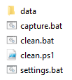
   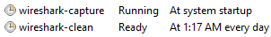

   *.pcap* capture files will begin populating the *data* folder after the installer has completed. You can edit *settings.bat* to alter some parameters after the fact, if necessary.

5. After running the installer, I recommend that you wait at least 72 hours so sufficient data can be collected.
6. Install this WebCTRL add-on, and navigate to its main page.
7. Configure the packet capture directory to be the path to the *data* folder generated by the installer. Optionally, configure an email subject and recipients for alarm notifications. You may also select which alarm types should generate an email, and you can edit threshold values that determine what constitutes an alarm. Click the *Save Changes* button and then the *Analyze Now* button when you are finished.

   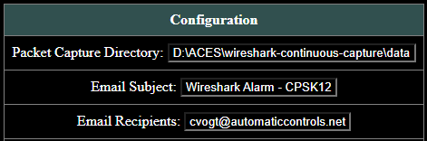

8. Refresh the page every couple minutes and wait for some data to populate in the GUI. Once data populates, the initial analysis is complete.

## Implementation Details

If you hover your cursor over certain fields in the add-on configuration pages, a hovertext description of the field will appear. Groupings of checkboxes can be selected or deselected all at once by holding CTRL down when you click. The *Revert to Defaults* button resets all alarm thresholds to their default values. The *Download Packets* button downloads the latest *.pcap* capture file to your computer. Once configured, the add-on will perform an analysis once every three hours, and approximately three days worth of packets will be kept loaded into RAM at all times. The RAM field on the main configuration page provides an estimate for how much memory is used (I would expect this to be on the order of 40-120MB depending on system size). A hard limit of 1048576 cached packets is enforced to prevent too much RAM usage. The statistics page can be used to view a trend of packets/second for each broadcast type over time (records are retained for 365 days). Hold shift or CTRL while moving your cursor over the statistics graph to lock to the nearest data point. You should not expect the statistics graph to immediately show improvements when you fix an issue because stats are computed based on a 72 hours rolling window of data (i.e, wait a few days to see how changes affect the graph).

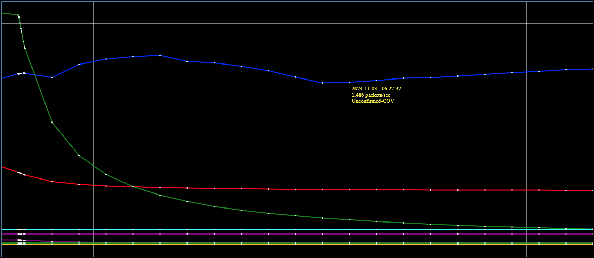

Alarm notifications only happen on activation. There are no *return-to-normal* notifications. If an active alarm fails to meet the original alarm condition 8 checks in a row (approximately 24 hours), then the alarm is considered to have normalized, and it is removed from the queue. If you dismiss an alarm from the UI, then it will stay deactivated for at least 3.5 days. After the 3.5 day timeout period, the alarm may be reactivated if the alarming condition is still met. Since alarm conditions are evaluated on a 72 hour rolling window of packet capture data, the 3.5 day dismissal timeout allows more than a full 72 hours to pass so that old packets are not influencing the alarm if you fix the underlying issue before dismissing the alarm. It you delete an alarm instead of dismissing it, the alarm can potentially be reactivated during the next analysis even if the issue is fixed. If you press the *Resolve* button next to an alarm, the add-on will try to navigate your browser to the relevant device on WebCTRL's network tree based on the IP address of the top-level router, the network number, and the MAC address of the source device. The last line in an alarm's description is typically a filter you can use in Wireshark to see the packets for yourself.

You should ensure WebCTRL's email configuration is setup properly in system settings. If an email server is not configured, then notifications will not work.

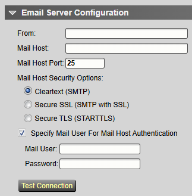

## Network Troubleshooting

The purpose of this section is to provide a few common examples of alarms and how to resolve them. If you want to learn more about BBMDs and broadcast traffic in general, I'd suggest reading <https://docs.automaticcontrols.net/bbmd/>. Note that this link is only accessible from within the ACES network or VPN.

### Who-Is Spam - Global

This alarm is one of the more important ones to resolve. Because a single global Who-Is packet can trigger a flood of I-Am packets in response.

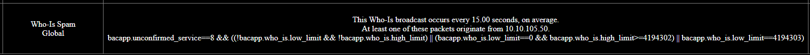

The *Resolve* button will not work in this case because the IP address 10.10.105.50 does not correspond to an ALC router on the network tree. It is a third-party IP device. Use the manual command `bbmd viewall` and search for *10.10.105* to find the ALC router serving the IP device's subnet. There are other ways you can get a list of IP addresses for the top-level IP routers, but this is one of the easiest assuming BBMDs are autoconfigured.

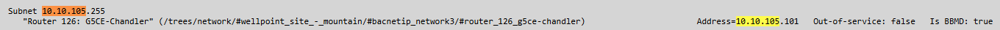

If you use the manual command `bacnet bind show` or `bacnet whois` and search for the IP address, you should be able to grab the device instance. In this case, the device instance is 21261.

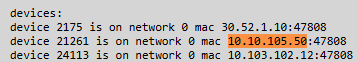

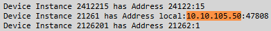

The next step is to look under the top-level router we found in the first step, *Router 126: G5CE-Chandler*. Look through the integration programs and find some network points that map to device instance 21261.

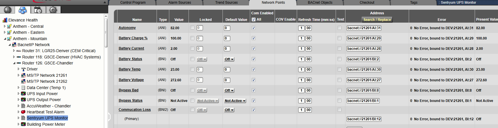

If you use the manual command `showdeviceids 21261`, you can get the name of the device. Be sure to use this command on either the root of the network tree or the *Discovered Networks* node. This command is apparently sensitive to the current location.

You can use the *Discovered Networks* section in WebCTRL to see more information about the device. Since it is an IP device, you should look under the *Local Network*. You may have to execute the *discovery* function if devices are not showing up.

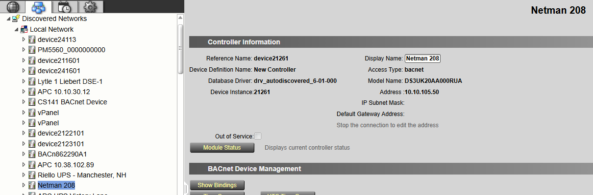

Depending on the third-party device, you may be able to fix the issue by altering some BACnet object values.

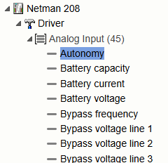

In this particular case, there does not appear to be a good way to stop the Who-Is packet spams from WebCTRL. The next step would be to lookup some documentation for the device and see if anything can be done to fix the issue onsite. Maybe a call to the third-party tech support could be helpful too. For this Netman 208, Zach and I were unable to determine a way to stop the broadcasts (at the time of writing this article). To mitigate the issue, we wrote a manual BBMD table to Router 126 with the manual command `bbmd writeaddresses "10.10.105.101;10.10.1.11"`. This stops the Who-Is broadcast from progagating all throughout Elevance's network (i.e, instead of everything responding with I-Am packets, only the devices directly in the 10.10.105.x subnet respond).

For simplicity, the alarm UI only lists one source for the packets, but there may be multiple. After looking through a downloaded packet capture using the Wireshark filter suggested by the alarm description, it turns out a device with IP address 30.52.1.10 has the same problem. So we implemented the same sort of mitigation with the manual command `bbmd writeaddresses "30.52.1.24;10.10.1.11"` on *Router 75: LGR25-Manchester*. Normally, if you fix the alarm for the first source, the second source will pop-up at the next analysis.

### Unanswered Who-Is

This is probably going to be the most common type of alarm because it usually corresponds to unbound network points.

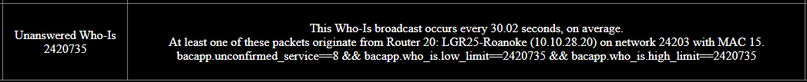

The first step is to click the *Resolve* button. It should navigate your browser directly to the device in question on the network tree. Then look through the control programs under the device to find unbound network points.

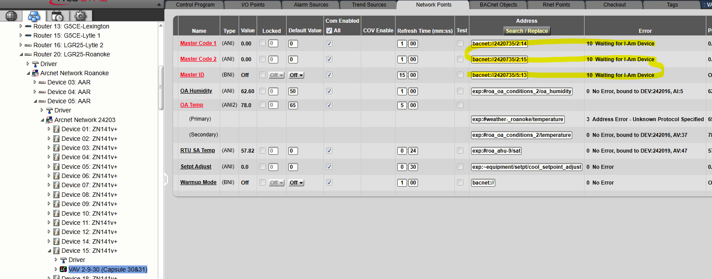

Note that the device instance in the unbound network points match the device instance specified in the alarm. Disable communication on these network points to fix the issue. Since the alarm says the frequency of the broadcast occurs every 30 seconds, I'm going to guess that there's two source devices causing the problem (from experience, I've found that the frequency is usually every 60 seconds if it is just one device). To find the other device, wait a couple minutes, and then click the *Analyze Now* button on the main configuration page. The alarm description always shows the source of the most recently captured packet, so the second source should popup in the alarms page if the first source has been resolved.

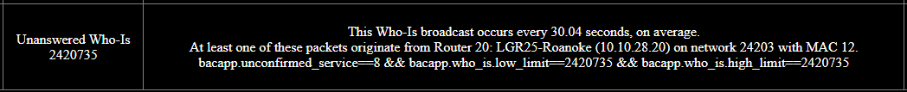

The device with MAC 12 under the same network apparently has the same issue. So we disable communication on those network points too. We can use the same procedure to check for additional sources. Wait a couple minutes, click *Analyze Now*, wait another few seconds, then check the alarms page again. If the source stays the same (which is true for this case), then there are no additional sources. After enumerating all sources in this manner, dismiss the alarm.

If there are lots of sources for a single alarm, it may be more efficient to manually search through the devices you suspect are culprit. You can also try using *global modify*. Or you can download a *.pcap* and manually sort through the packets to find all sources (use the Wireshark filter suggested by the alarm description). Or remote into the server and run a live packet capture. It is up to your preference.

Some annoying network points are those of the POLLTOT type (and similar). Because you can have half of the points communicating and half of them unbound. There's no good way to disable the bad points while leaving the good ones untouched. And then we can't take the bad points out because of source tree rules often enforcing them. Either disable communication on all the points (including the good), or let the bad points continue spamming the network.

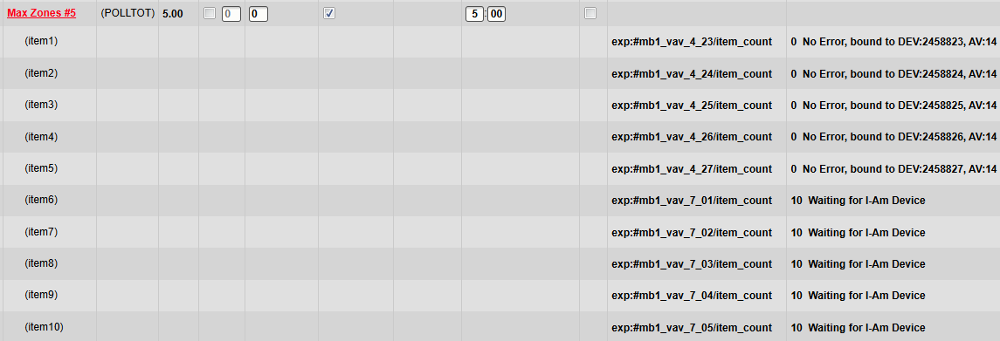

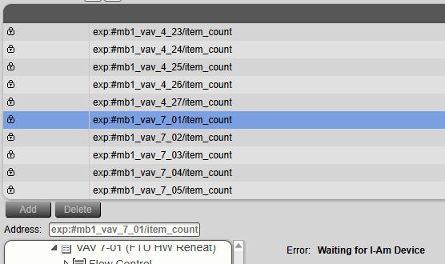

### Unanswered Who-Has

This type of alarm may also correspond to unbound network points.

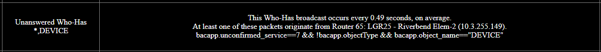

After clicking the *Resolve* button, we look through the programs downloaded to the router.

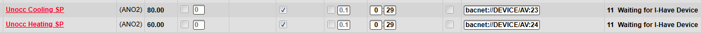

Just about every single program under the router has a couple points that look like this. So we disable communication on all of them. Since the packets are extremely frequent with this alarm, there is probably more than one source. So we iterate through all possible sources as described in the previous section.

### Unconfirmed-COV Spam

This type of alarm usually occurs when the COV increment is too small on a BACnet object that is network visible.

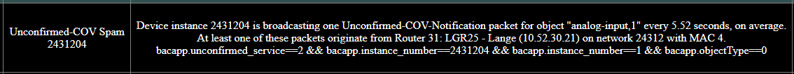

Click the *Resolve* button and navigate to the *BACnet Objects* properties page.

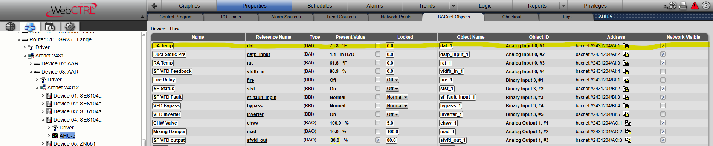

So this alarm is caused by the *DA Temp* object. Note the device instance matches, and it is analog input #1. You can increase the COV increment by clicking on the object's reference name and going to the *Details* tab.

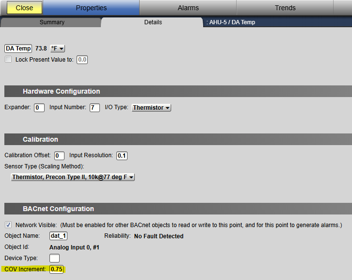

The COV increment specifies how much the value has to change before subscribers are notified via an Unconfirmed-COV broadcast packet. So it effectively specifies the resolution you want for any network points mapped to this object. If there is only one subscriber to a network point (this may be the case if the BACnet object lives in a third-party device and there is just one control program mapped to the point), then you can opt to use confirmed COV notifications, which do not generate broadcast traffic. Enter 01 in the seconds field of the network point refresh time to configure confirmed COV. Unconfirmed COV should generally be used anytime there is more than one subscriber. If the network point and BACnet object live under the same top-level IP router, then the ALC devices may choose to use unicast traffic instead of broadcast regardless of setting 01 in the seconds field. So it is desirable to limit the number of network points mapped between different top-level routers.

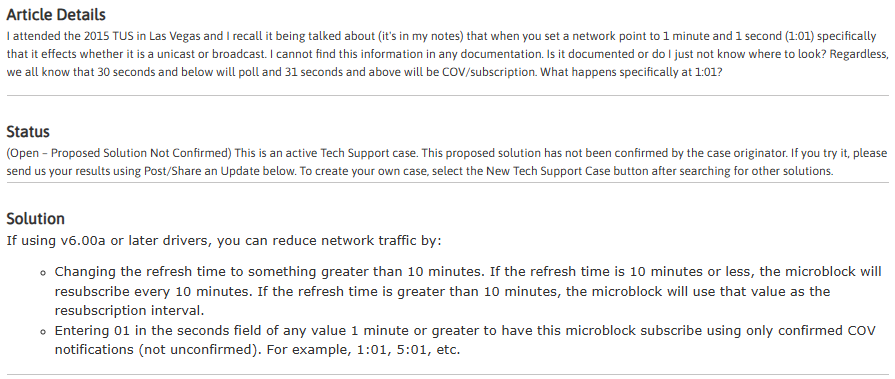

- <https://automatedlogic.my.site.com/alc/s/knowledge/article/SCS-TM6544341#>
- <https://automatedlogic.my.site.com/alc/s/knowledge/article/SCS-MM6532270#>
- <https://automatedlogic.my.site.com/alc/s/knowledge/article/Conceptsnetwork-26442#>

## Wireshark Overview

### Live Capture

When you want to take a live capture, open a fresh Wireshark instance, left-click the network interface WebCTRL communicates over (usually the interface labelled *Ethernet*), put `udp port 47808` in the capture filter field, right-click on the interface, then hit *Start capture*.

After starting the live capture, you can add a display filter to get more specific. Note that capture filter syntax and display filter syntax is different. For example, to retrieve *most* packets to-and-from a router with IP address 192.168.1.1, you can use the display filter: `ip.src_host==192.168.1.1 || ip.dst_host==192.168.1.1 || bvlc.fwd_ip==192.168.1.1`. Some relevant broadcast packets may not be shown due to how broadcast packets are hopped among BBMDs, but this filter should get most of them. To compactly filter multiple IP addresses, you can use syntax like `bvlc.fwd_ip in {192.168.1.1,192.168.2.1,192.168.3.1}`. See <https://wiki.wireshark.org/DisplayFilters> and <https://wiki.wireshark.org/CaptureFilters> for more information.

### Packet Analysis

When you click on a captured packet, all details about the packet show up at the bottom of the screen. The following example shows details from a Who-Is broadcast packet. I've highlighted the bits you should pay attention to.

The IP addresses I've highlighted in green specify the true source of the Who-Is packet. To find the source, one should look for a device with MAC address 7 under network 2463 somewhere under a top-level router with IP address 10.11.255.148. The information highlighted in blue tells us that this Who-Is packet is looking for a device with instance number 2449905. If you click on a field, the area highlighted in orange at the bottom of the screen tells you what sort of display filter you need if you want to filter for that field. In this case, you could use filter `bacapp.unconfirmed_service==8` to select all Who-Is packets. The area on the right shows the raw byte data of the packet in hexadecimal notation.

The IP addresses I've highlighted in yellow are the direct source and destination IP addresses for the packet. Since this is a broadcast packet and FDR is enabled on the server, we can expect 10.15.255.149 to be the IP address of the primary BBMD for FDR, and we can expect 10.34.2.6 to be the IP address of the WebCTRL server. Because all broadcast packets are hopped through the primary BBMD before reaching the WebCTRL server when FDR is enabled.

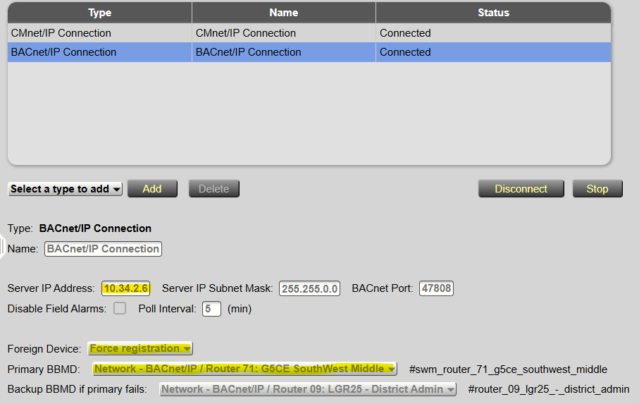

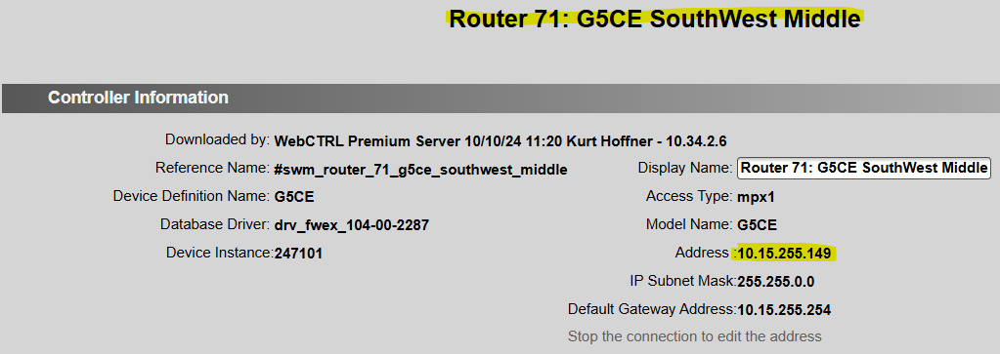

### Other Tips

If you navigate to *Analyze* &rarr; *Display Filter Expression...* at the top of the screen, you can get a sense for all possible display filters. Try searching either *bacapp*, *bacnet*, or *bvlc* for filters relevant to the BACnet/IP protocol.

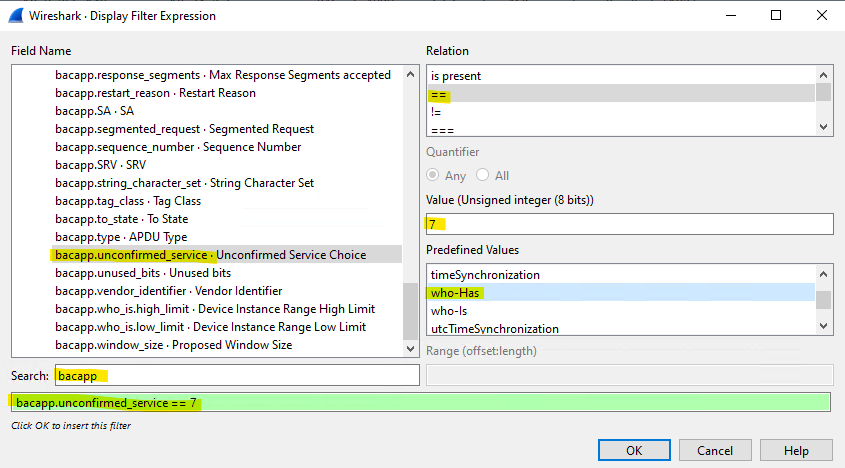

If you navigate to *Statistics* &rarr; *BACnet* at the top of the screen, you'll see there are a few options for computing summary information about the capture from within Wireshark. For example, you can use the filter `bvlc.function in {0x4,0xB}` to see statistics about broadcast packets. Note that these particular statistics completely ignore Who-Is-Router and I-Am-Router packets, so you should trust the statistics given by the add-on or compute them yourself when in doubt.

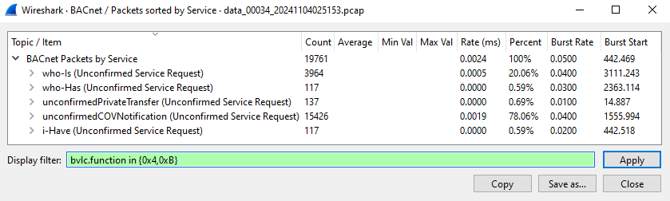

### Handy Filters

| Display Filter | Description |
| - | - |
| `bvlc.function in {0x4,0xB}` | Broadcast traffic |
| `bvlc.function in {0x4,0xB} && (!bacnet.mesgtyp \|\| bacnet.mesgtyp not in {0,1}) && (!bacapp.unconfirmed_service \|\| bacapp.unconfirmed_service not in {0,1,2,7,8})` | Unhandled broadcast traffic, which is placed into the *Other* category by the add-on |
| `bacapp.unconfirmed_service==0` | I-Am packets |
| `bacapp.unconfirmed_service==1` | I-Have packets |
| `bacapp.unconfirmed_service==2` | Unconfirmed-COV packets |
| `bacapp.unconfirmed_service==7` | Who-Has packets |
| `bacapp.unconfirmed_service==8` | Who-Is packets |
| `bacapp.unconfirmed_service==8 && ((!bacapp.who_is.low_limit && !bacapp.who_is.high_limit) \|\| (bacapp.who_is.low_limit==0 && bacapp.who_is.high_limit>=4194302) \|\| bacapp.who_is.low_limit==4194303)` | Global Who-Is packets |
| `bacnet.mesgtyp==0` | Who-Is-Router packets |
| `bacnet.mesgtyp==1` | I-Am-Router packets |
| `(bacnet \|\| bvlc \|\| bacapp) && (udp.dstport!=47808 \|\| udp.srcport!=47808)` | BACnet/IP traffic running on other UDP ports |